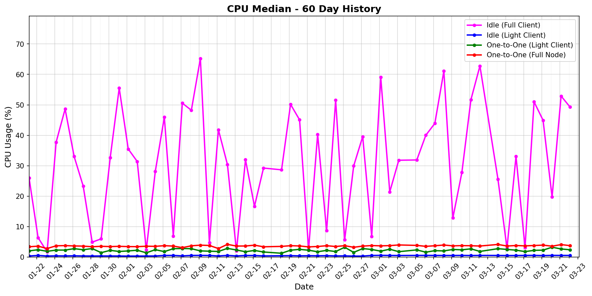
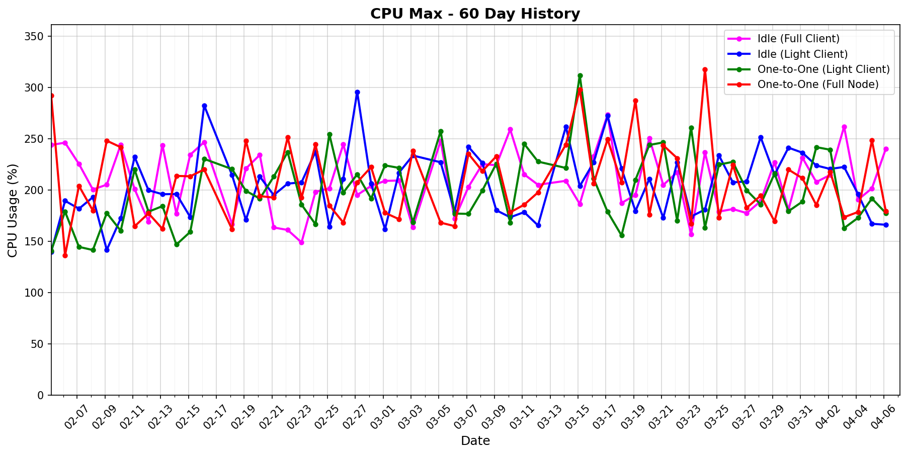
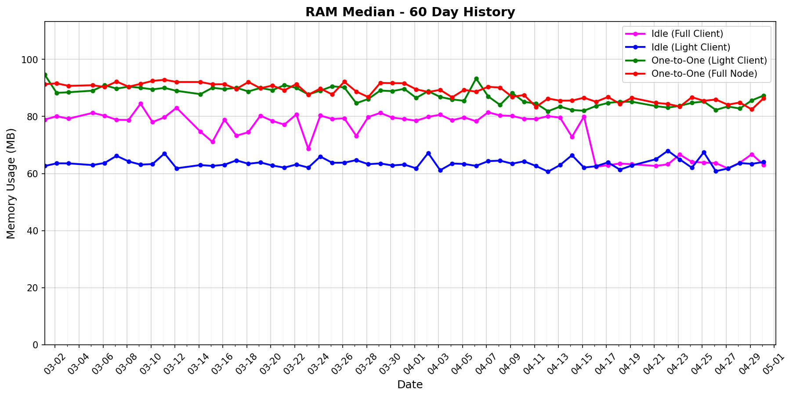
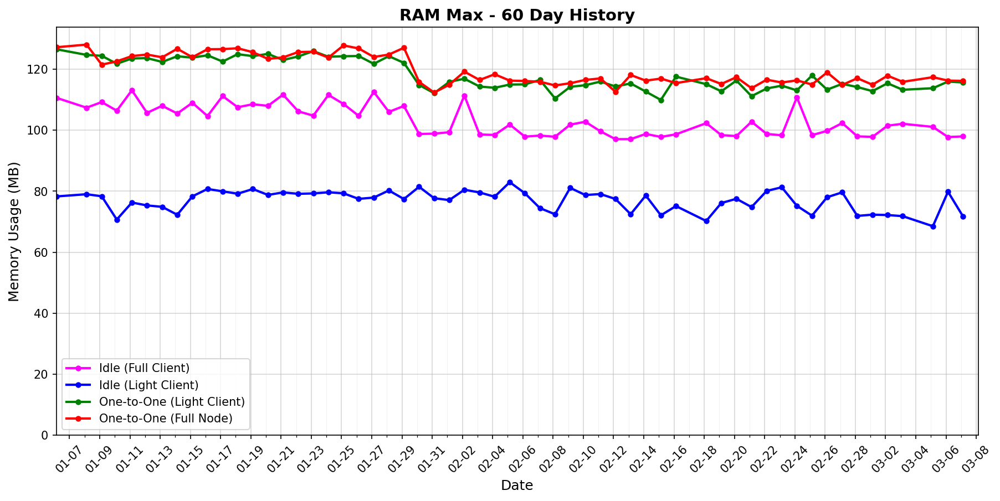
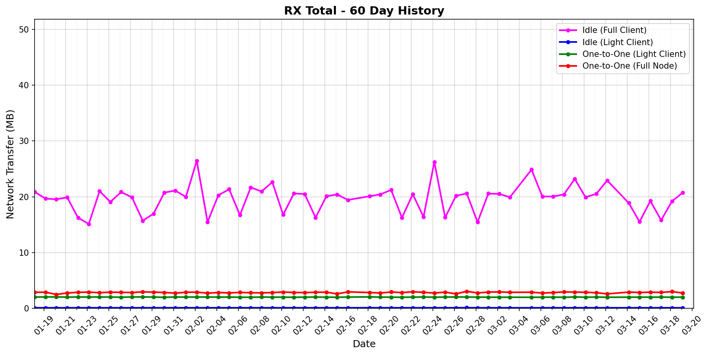
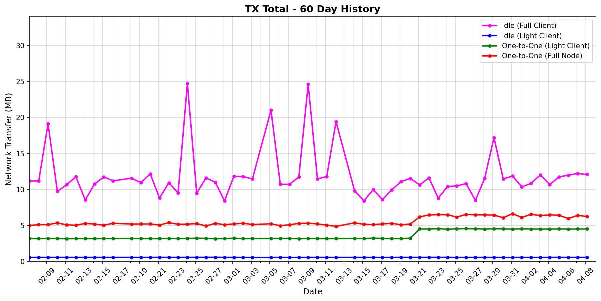
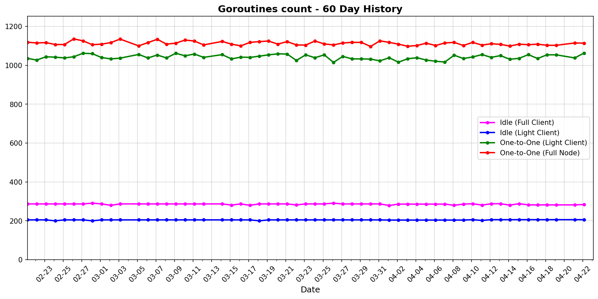
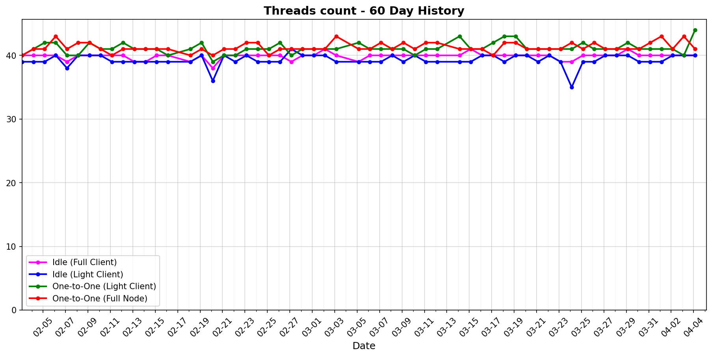

# status-go-benchmarks

Benchmark metrics with 60-day history and latest comparison.

## 60-Day History

| Metric History                                                     | Metric History                                               |
|--------------------------------------------------------------------|--------------------------------------------------------------|
|              |              |
|              |              |
|                  |            |
|  |  |

## Latest Report (2025-10-27)

| Run       | Date       | Time     | Commit      |
|-----------|------------|----------|-------------|
| Contender | 2025-10-27 | 03:07:45 | `2c48ce7ec` |
| Baseline  | 2025-10-26 | 03:08:31 | `2c48ce7ec` |

| Metric                | test_idle [waku_light_client_False]                                                                                             | test_idle [waku_light_client_True]                                                                                            | test_one_to_one_messages [waku_light_client_True]                                                                                                           | test_one_to_one_messages [waku_light_client_False]                                                                                                            |
|-----------------------|------------------------------------------------------------------------------------------------------------------------------------|----------------------------------------------------------------------------------------------------------------------------------|----------------------------------------------------------------------------------------------------------------------------------------------------------------|------------------------------------------------------------------------------------------------------------------------------------------------------------------|
| CPU Median            | 2.22% (-93.5%)                                                                                                                     | 0.51% (+4.8%)                                                                                                                    | 1.50% (-0.4%)                                                                                                                                                  | 2.08% (-0.7%)                                                                                                                                                    |
| CPU Max               | 125.33% (-28.2%)                                                                                                                   | 122.22% (+0.4%)                                                                                                                  | 131.36% (+2.4%)                                                                                                                                                | 132.82% (-0.2%)                                                                                                                                                  |
| RAM Median            | 73.70 MB (+1.8%)                                                                                                                   | 54.32 MB (+0.4%)                                                                                                                 | 78.27 MB (-0.9%)                                                                                                                                               | 80.15 MB (-2.6%)                                                                                                                                                 |
| RAM Max               | 92.88 MB (-3.3%)                                                                                                                   | 61.89 MB (-0.1%)                                                                                                                 | 107.59 MB (-0.5%)                                                                                                                                              | 111.63 MB (+2.8%)                                                                                                                                                |
| RX Total              | 38.66 MB (-19.1%)                                                                                                                  | 101.0 KB (-0.3%)                                                                                                                 | 2.00 MB (+0.4%)                                                                                                                                                | 2.90 MB (+0.2%)                                                                                                                                                  |
| TX Total              | 21.74 MB (-18.7%)                                                                                                                  | 571.4 KB (+0.1%)                                                                                                                 | 3.11 MB (-0.0%)                                                                                                                                                | 5.03 MB (-1.1%)                                                                                                                                                  |
| Goroutines count      | 286 (0%)                                                                                                                           | 204 (0%)                                                                                                                         | 1127 (+0.4%)                                                                                                                                                   | 1183 (+0.7%)                                                                                                                                                     |
| Threads count         | 39 (0%)                                                                                                                            | 39 (0%)                                                                                                                          | 40 (-2.4%)                                                                                                                                                     | 40 (0%)                                                                                                                                                          |
| **Performance Chart** | ![test_idle[waku_light_client_False]](benchmarks/20251027T030745_2c48ce7ec/test_idle[waku_light_client_False]-20251027-025953.png) | ![test_idle[waku_light_client_True]](benchmarks/20251027T030745_2c48ce7ec/test_idle[waku_light_client_True]-20251027-030127.png) | ![test_one_to_one_messages[waku_light_client_True]](benchmarks/20251027T030745_2c48ce7ec/test_one_to_one_messages[waku_light_client_True]-20251027-030701.png) | ![test_one_to_one_messages[waku_light_client_False]](benchmarks/20251027T030745_2c48ce7ec/test_one_to_one_messages[waku_light_client_False]-20251027-030412.png) |
