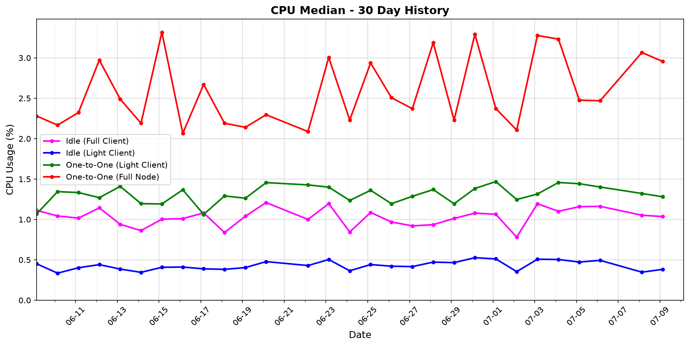
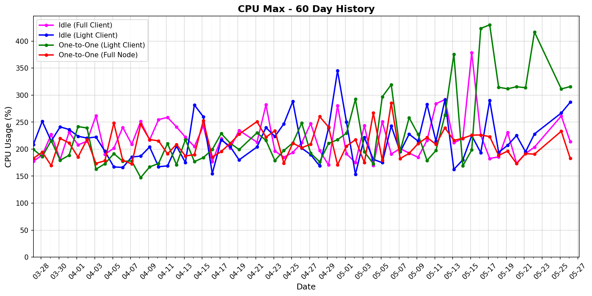
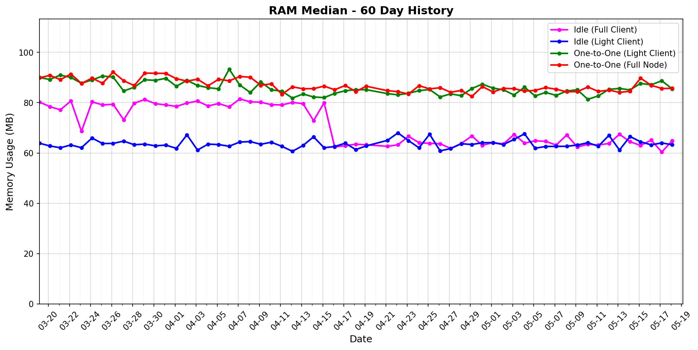
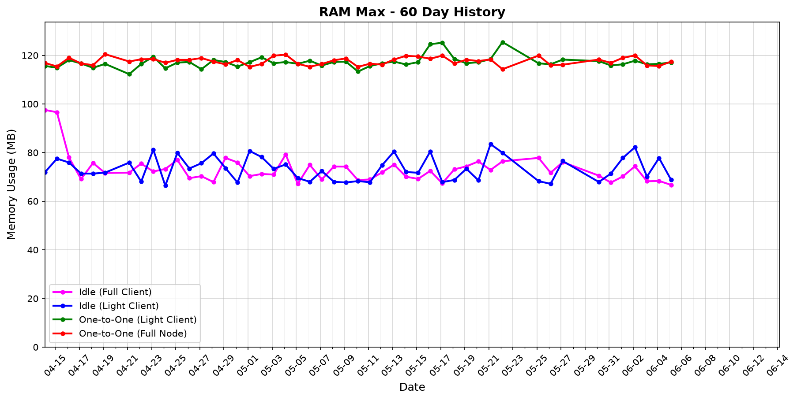
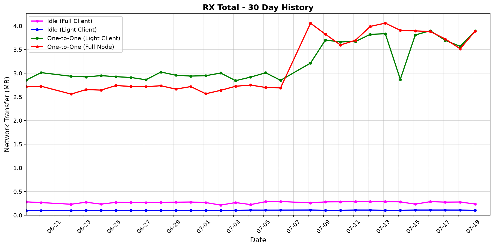
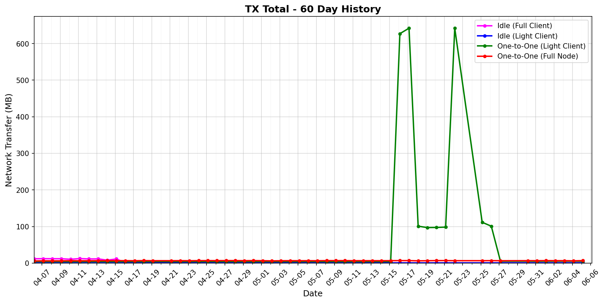
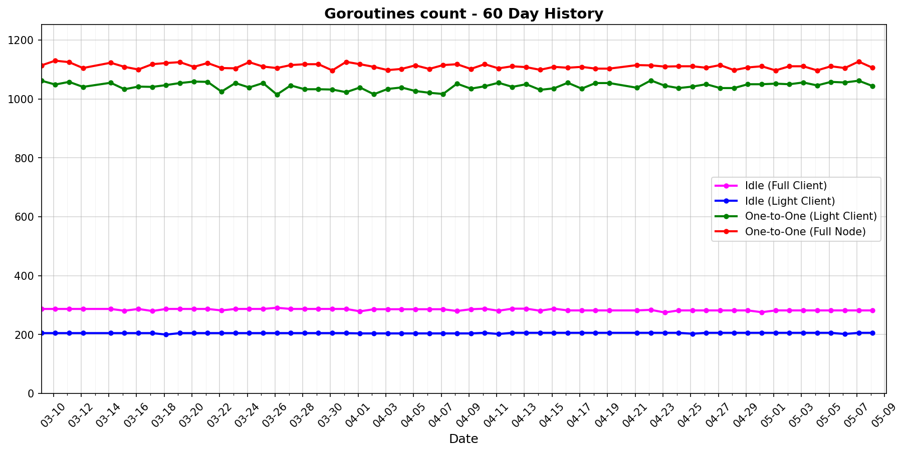
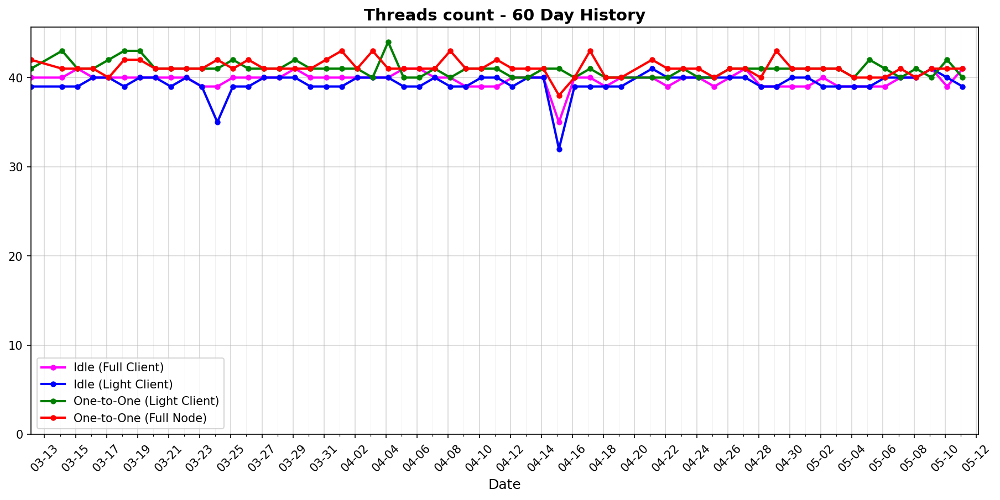

# status-go-benchmarks

Benchmark metrics with 60-day history and latest comparison.

## 60-Day History

| Metric History                                                     | Metric History                                               |
|--------------------------------------------------------------------|--------------------------------------------------------------|
|              |              |
|              |              |
|                  |            |
|  |  |

## Latest Report (2026-02-28)

| Run       | Date       | Time     | Commit      |
|-----------|------------|----------|-------------|
| Contender | 2026-02-28 | 03:07:42 | `54a4cdf79` |
| Baseline  | 2026-02-27 | 03:08:46 | `54a4cdf79` |

| Metric                | test_idle [waku_light_client_False]                                                                                             | test_idle [waku_light_client_True]                                                                                            | test_one_to_one_messages [waku_light_client_True]                                                                                                           | test_one_to_one_messages [waku_light_client_False]                                                                                                            |
|-----------------------|------------------------------------------------------------------------------------------------------------------------------------|----------------------------------------------------------------------------------------------------------------------------------|----------------------------------------------------------------------------------------------------------------------------------------------------------------|------------------------------------------------------------------------------------------------------------------------------------------------------------------|
| CPU Median            | 6.82% (-82.8%)                                                                                                                     | 0.55% (+61.5%)                                                                                                                   | 2.50% (-10.6%)                                                                                                                                                 | 3.79% (+5.1%)                                                                                                                                                    |
| CPU Max               | 203.89% (+4.5%)                                                                                                                    | 206.22% (-30.2%)                                                                                                                 | 191.65% (-10.9%)                                                                                                                                               | 222.26% (+7.1%)                                                                                                                                                  |
| RAM Median            | 74.75 MB (-6.6%)                                                                                                                   | 66.13 MB (+2.7%)                                                                                                                 | 88.41 MB (+0.5%)                                                                                                                                               | 91.08 MB (-0.8%)                                                                                                                                                 |
| RAM Max               | 98.01 MB (-4.3%)                                                                                                                   | 71.91 MB (-9.7%)                                                                                                                 | 114.18 MB (-0.9%)                                                                                                                                              | 117.06 MB (+1.9%)                                                                                                                                                |
| RX Total              | 15.45 MB (-25.0%)                                                                                                                  | 101.4 KB (-16.8%)                                                                                                                | 2.01 MB (-0.8%)                                                                                                                                                | 2.76 MB (-9.7%)                                                                                                                                                  |
| TX Total              | 8.40 MB (-23.6%)                                                                                                                   | 576.8 KB (-2.9%)                                                                                                                 | 3.19 MB (+0.8%)                                                                                                                                                | 5.11 MB (-3.5%)                                                                                                                                                  |
| Goroutines count      | 291 (+1.4%)                                                                                                                        | 200 (-2.4%)                                                                                                                      | 1060 (-0.2%)                                                                                                                                                   | 1106 (-1.8%)                                                                                                                                                     |
| Threads count         | 40 (+2.6%)                                                                                                                         | 40 (-2.4%)                                                                                                                       | 41 (+2.5%)                                                                                                                                                     | 41 (0%)                                                                                                                                                          |
| **Performance Chart** | ![test_idle[waku_light_client_False]](benchmarks/20260228T030742_54a4cdf79/test_idle[waku_light_client_False]-20260228-025920.png) | ![test_idle[waku_light_client_True]](benchmarks/20260228T030742_54a4cdf79/test_idle[waku_light_client_True]-20260228-030057.png) | ![test_one_to_one_messages[waku_light_client_True]](benchmarks/20260228T030742_54a4cdf79/test_one_to_one_messages[waku_light_client_True]-20260228-030645.png) | ![test_one_to_one_messages[waku_light_client_False]](benchmarks/20260228T030742_54a4cdf79/test_one_to_one_messages[waku_light_client_False]-20260228-030348.png) |
