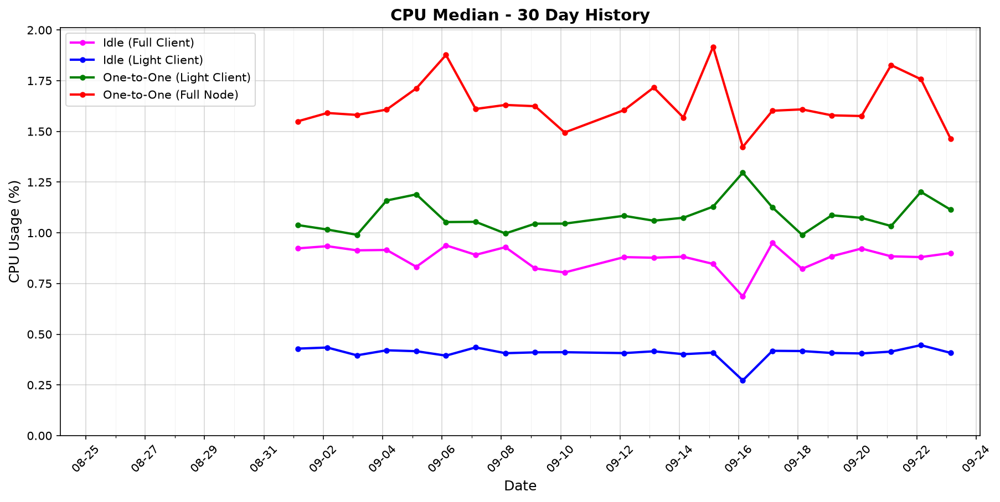
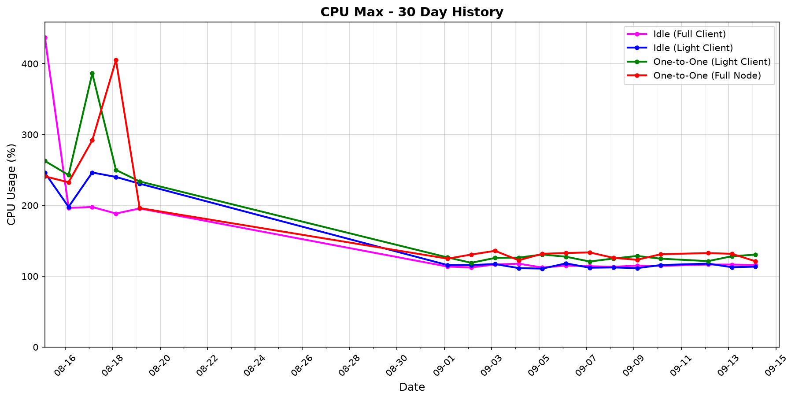
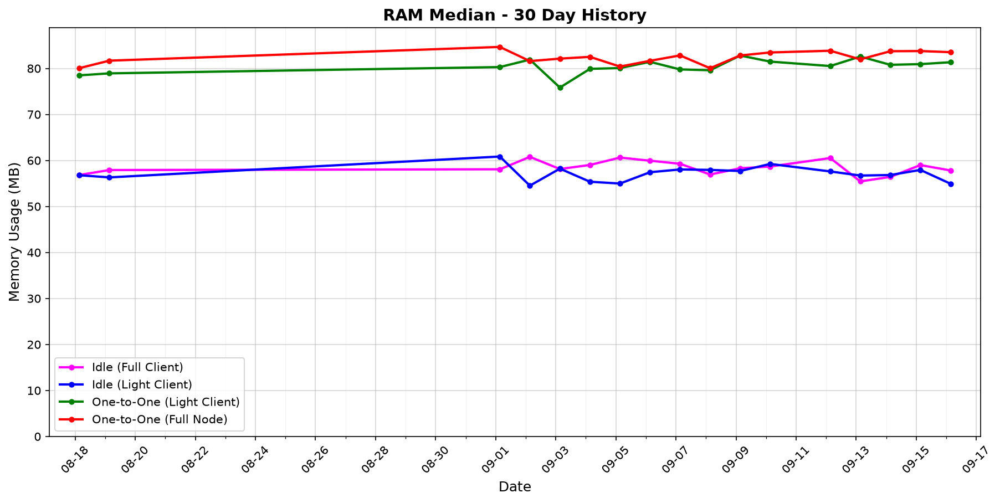
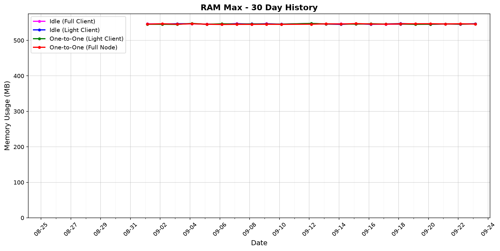
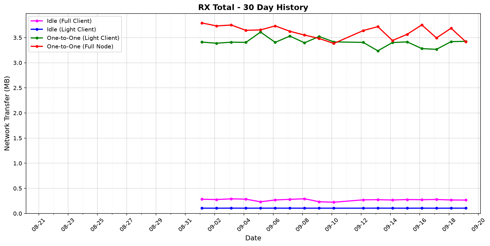
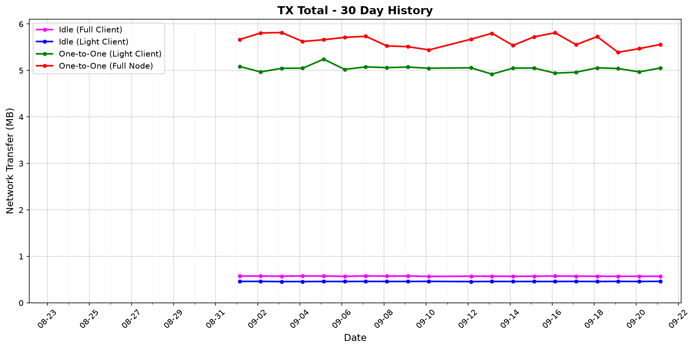
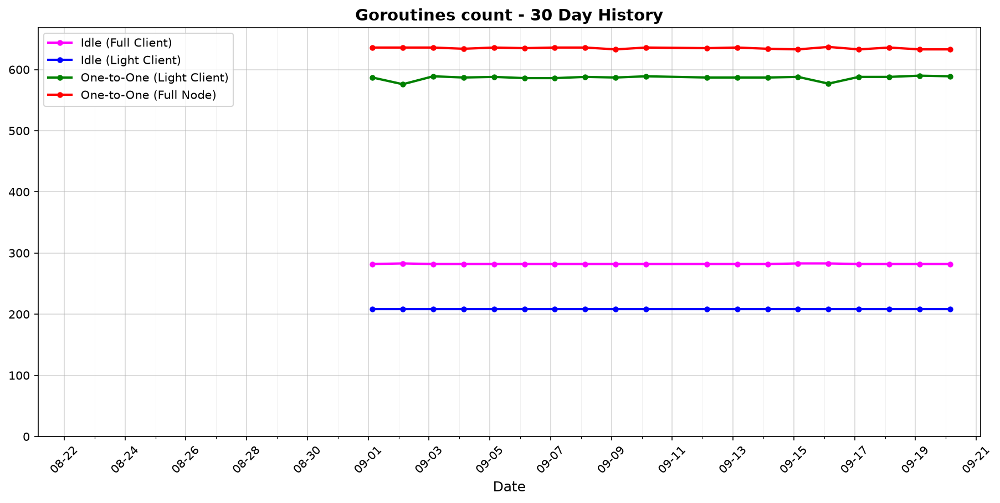
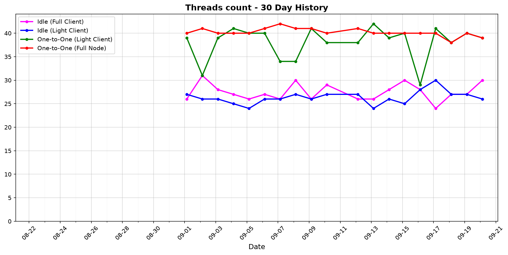

# status-go-benchmarks

Benchmark metrics with 30-day history and latest comparison.

## 30-Day History

| Metric History                                                     | Metric History                                               |
|--------------------------------------------------------------------|--------------------------------------------------------------|
|              |              |
|              |              |
|                  |            |
|  |  |

## Latest Report (2026-07-27)

| Run       | Date       | Time     | Commit      |
|-----------|------------|----------|-------------|
| Contender | 2026-07-27 | 03:15:59 | `4a2d6dac8` |
| Baseline  | 2026-07-26 | 03:16:35 | `4a2d6dac8` |

| Metric                | test_idle [waku_light_client_False]                                                                                             | test_idle [waku_light_client_True]                                                                                            | test_one_to_one_messages [waku_light_client_True]                                                                                                           | test_one_to_one_messages [waku_light_client_False]                                                                                                            |
|-----------------------|------------------------------------------------------------------------------------------------------------------------------------|----------------------------------------------------------------------------------------------------------------------------------|----------------------------------------------------------------------------------------------------------------------------------------------------------------|------------------------------------------------------------------------------------------------------------------------------------------------------------------|
| CPU Median            | 0.90% (-19.3%)                                                                                                                     | 0.51% (+8.1%)                                                                                                                    | 1.48% (-2.5%)                                                                                                                                                  | 2.48% (-29.9%)                                                                                                                                                   |
| CPU Max               | 261.02% (+45.4%)                                                                                                                   | 178.31% (-12.5%)                                                                                                                 | 307.13% (+76.6%)                                                                                                                                               | 172.47% (-32.8%)                                                                                                                                                 |
| RAM Median            | 55.06 MB (-2.9%)                                                                                                                   | 55.07 MB (-3.2%)                                                                                                                 | 73.82 MB (-1.4%)                                                                                                                                               | 78.84 MB (-0.0%)                                                                                                                                                 |
| RAM Max               | 59.36 MB (-2.5%)                                                                                                                   | 59.17 MB (-2.2%)                                                                                                                 | 84.76 MB (-12.4%)                                                                                                                                              | 86.08 MB (+2.0%)                                                                                                                                                 |
| RX Total              | 222.5 KB (-23.4%)                                                                                                                  | 110.0 KB (+0.5%)                                                                                                                 | 3.93 MB (+3.6%)                                                                                                                                                | 3.62 MB (-4.0%)                                                                                                                                                  |
| TX Total              | 582.3 KB (-2.2%)                                                                                                                   | 480.6 KB (+0.8%)                                                                                                                 | 5.33 MB (+2.7%)                                                                                                                                                | 5.71 MB (-0.3%)                                                                                                                                                  |
| Goroutines count      | 284 (0%)                                                                                                                           | 208 (-0.5%)                                                                                                                      | 568 (+0.5%)                                                                                                                                                    | 621 (+1.0%)                                                                                                                                                      |
| Threads count         | 35 (+2.9%)                                                                                                                         | 34 (+6.2%)                                                                                                                       | 41 (0%)                                                                                                                                                        | 41 (0%)                                                                                                                                                          |
| **Performance Chart** | ![test_idle[waku_light_client_False]](benchmarks/20260727T031559_4a2d6dac8/test_idle[wakuV2LightClient_False]-20260727-030731.png) | ![test_idle[waku_light_client_True]](benchmarks/20260727T031559_4a2d6dac8/test_idle[wakuV2LightClient_True]-20260727-030905.png) | ![test_one_to_one_messages[waku_light_client_True]](benchmarks/20260727T031559_4a2d6dac8/test_one_to_one_messages[wakuV2LightClient_True]-20260727-031449.png) | ![test_one_to_one_messages[waku_light_client_False]](benchmarks/20260727T031559_4a2d6dac8/test_one_to_one_messages[wakuV2LightClient_False]-20260727-031156.png) |
