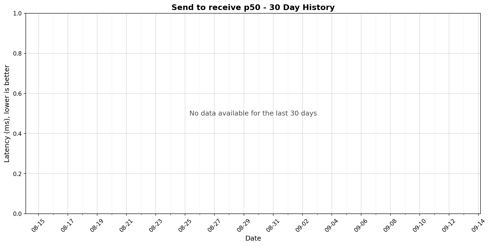
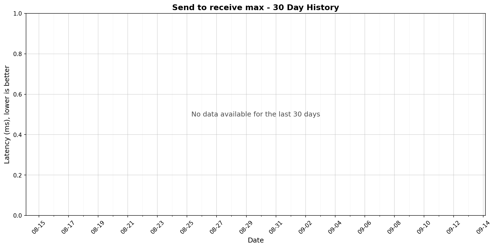
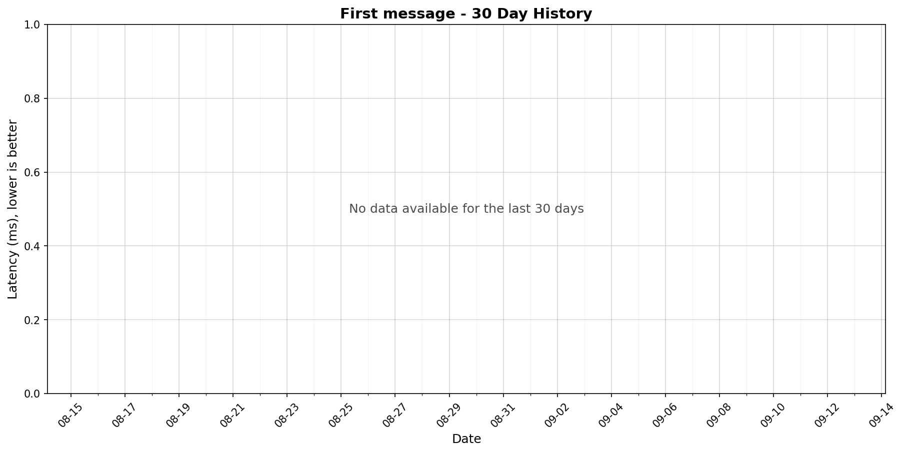
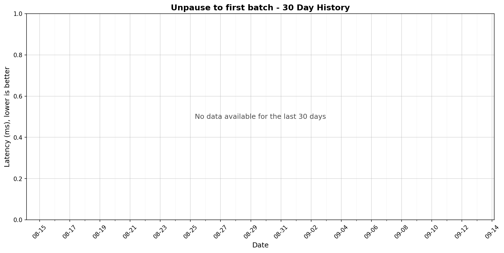

# status-go-benchmarks

Benchmark metrics with 30-day history and latest comparison.

## 30-Day History

| Metric History                                                     | Metric History                                               |
|--------------------------------------------------------------------|--------------------------------------------------------------|
|              |              |
|              |              |
|                  |            |
|  |  |

## Latest Report (2026-09-14)

| Run       | Date       | Time     | Commit      |
|-----------|------------|----------|-------------|
| Contender | 2026-09-14 | 03:16:24 | `65e177a4f` |
| Baseline  | 2026-09-13 | 03:16:01 | `65e177a4f` |

| Metric                | test_idle [waku_light_client_False]                                                                                             | test_idle [waku_light_client_True]                                                                                            | test_one_to_one_messages [waku_light_client_True]                                                                                                           | test_one_to_one_messages [waku_light_client_False]                                                                                                            |
|-----------------------|------------------------------------------------------------------------------------------------------------------------------------|----------------------------------------------------------------------------------------------------------------------------------|----------------------------------------------------------------------------------------------------------------------------------------------------------------|------------------------------------------------------------------------------------------------------------------------------------------------------------------|
| CPU Median            | 0.88% (+0.6%)                                                                                                                      | 0.40% (-3.4%)                                                                                                                    | 1.07% (+1.4%)                                                                                                                                                  | 1.57% (-8.6%)                                                                                                                                                    |
| CPU Max               | 115.96% (-0.5%)                                                                                                                    | 113.52% (+0.7%)                                                                                                                  | 130.52% (+1.8%)                                                                                                                                                | 121.13% (-8.0%)                                                                                                                                                  |
| RAM Median            | 56.42 MB (+1.8%)                                                                                                                   | 56.83 MB (+0.2%)                                                                                                                 | 80.78 MB (-2.2%)                                                                                                                                               | 83.74 MB (+2.2%)                                                                                                                                                 |
| RAM Max               | 546.73 MB (+0.1%)                                                                                                                  | 545.08 MB (-0.1%)                                                                                                                | 546.08 MB (-0.0%)                                                                                                                                              | 545.99 MB (-0.1%)                                                                                                                                                |
| RX Total              | 274.4 KB (-2.2%)                                                                                                                   | 108.2 KB (-0.4%)                                                                                                                 | 3.40 MB (+5.1%)                                                                                                                                                | 3.44 MB (-7.4%)                                                                                                                                                  |
| TX Total              | 584.2 KB (-0.5%)                                                                                                                   | 470.3 KB (-0.3%)                                                                                                                 | 5.05 MB (+2.6%)                                                                                                                                                | 5.54 MB (-4.5%)                                                                                                                                                  |
| Goroutines count      | 282 (0%)                                                                                                                           | 208 (0%)                                                                                                                         | 587 (0%)                                                                                                                                                       | 634 (-0.3%)                                                                                                                                                      |
| Threads count         | 28 (+7.7%)                                                                                                                         | 26 (+8.3%)                                                                                                                       | 39 (-7.1%)                                                                                                                                                     | 40 (0%)                                                                                                                                                          |
| **Performance Chart** | ![test_idle[waku_light_client_False]](benchmarks/20260914T031624_65e177a4f/test_idle[wakuV2LightClient_False]-20260914-030812.png) | ![test_idle[waku_light_client_True]](benchmarks/20260914T031624_65e177a4f/test_idle[wakuV2LightClient_True]-20260914-030945.png) | ![test_one_to_one_messages[waku_light_client_True]](benchmarks/20260914T031624_65e177a4f/test_one_to_one_messages[wakuV2LightClient_True]-20260914-031516.png) | ![test_one_to_one_messages[waku_light_client_False]](benchmarks/20260914T031624_65e177a4f/test_one_to_one_messages[wakuV2LightClient_False]-20260914-031230.png) |

## Delivery latency (lower is better)

One-to-one message latency from `test_delivery_latency`, in milliseconds. Lower is better. About 1 s of every send-to-receive figure and about 2 s of every send-to-delivered figure is a deliberate client-side timer, the receive debounce on each side.

- **Send to receive**: the sender's RPC return to the receiver's `messages.new` signal.
- **Send to delivered**: the sender's RPC return to its own `message.delivered` ack. It moves with the test's send cadence, so do not compare it across cadences.
- **Max**: the slowest of the 11 timed messages, not a percentile.
- **First message**: the first delivered message of the chat, reported on its own.
- **Offline row**: 12 messages queued while the receiver is paused; the figure is unpause to first batch. It counts all 12; per-message rows do not apply.
- **Blank**: fewer than five samples. **Dash**: the metric does not apply to the row. **N/A**: the run has no latency data.
- A row that lost timed messages shows no delta and is left off the history charts.

| Metric History                                                                 | Metric History                                                           |
|--------------------------------------------------------------------------------|--------------------------------------------------------------------------|
|        |  |
|    |              |
|  |                                                                          |

| Metric                               | test_delivery_latency [full_to_full]   | test_delivery_latency [light_to_full]   | test_delivery_latency [full_to_light]   | test_delivery_latency [light_to_light]   | test_delivery_latency [full_to_full_offline]   |
|--------------------------------------|-------------------------------------------|--------------------------------------------|--------------------------------------------|---------------------------------------------|---------------------------------------------------|
| Send to receive p50                  | N/A                                       | N/A                                        | N/A                                        | N/A                                         | N/A                                               |
| Send to receive max                  | N/A                                       | N/A                                        | N/A                                        | N/A                                         | N/A                                               |
| Send to delivered p50                | N/A                                       | N/A                                        | N/A                                        | N/A                                         | N/A                                               |
| First message                        | N/A                                       | N/A                                        | N/A                                        | N/A                                         | N/A                                               |
| Unpause to first batch               | N/A                                       | N/A                                        | N/A                                        | N/A                                         | N/A                                               |
| Messages received (receive timeouts) | N/A                                       | N/A                                        | N/A                                        | N/A                                         | N/A                                               |
