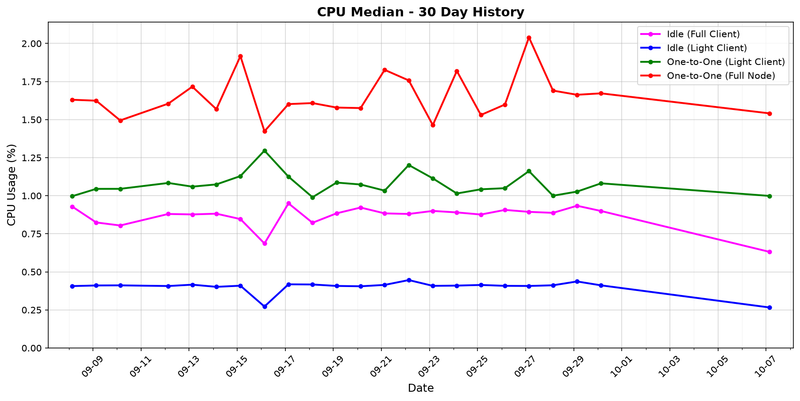
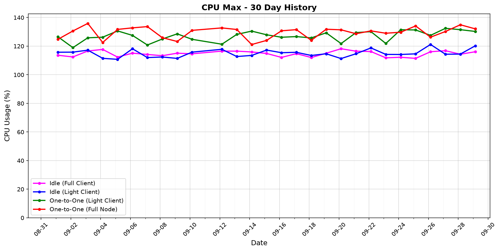
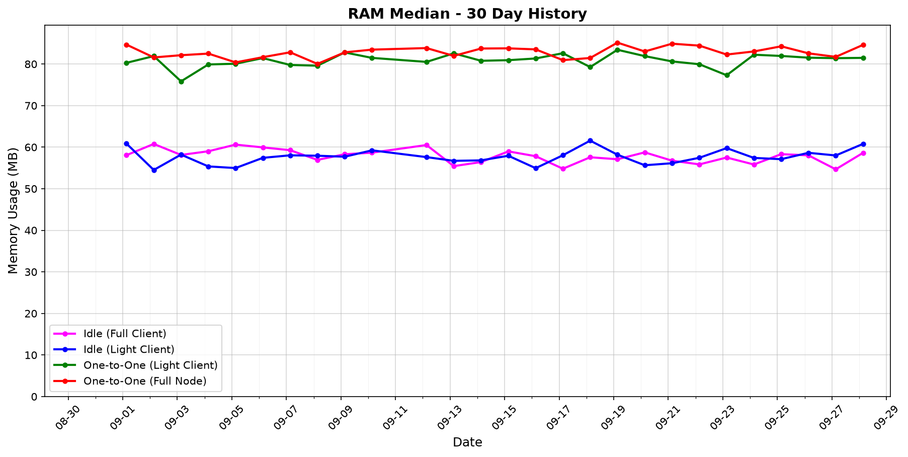
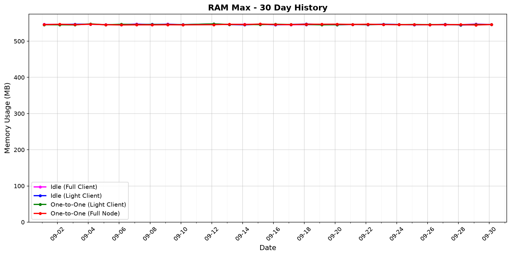
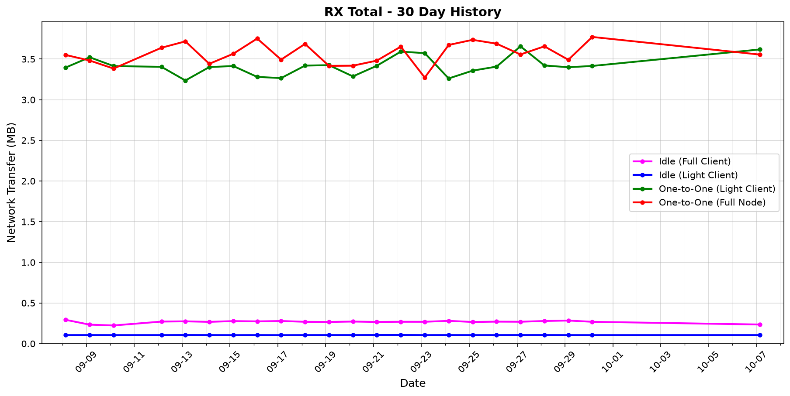
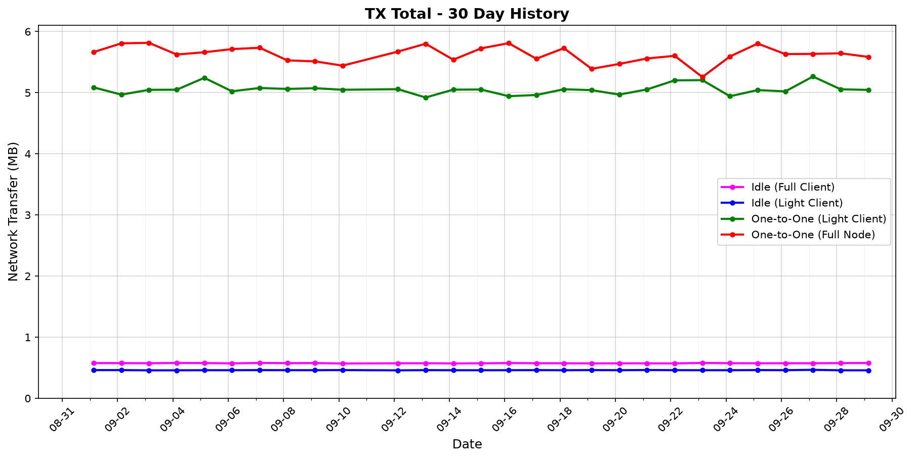
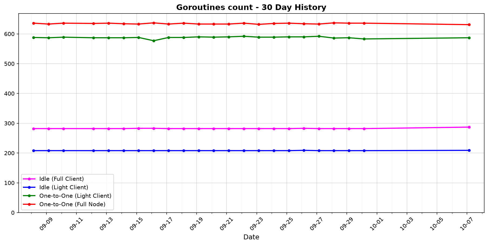
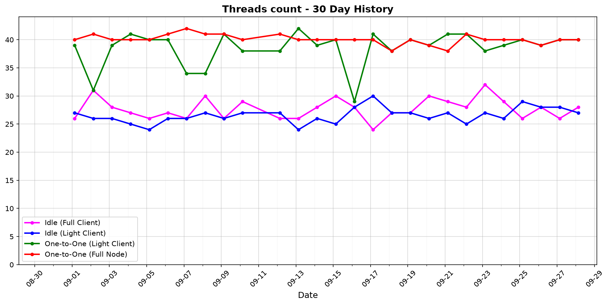

# status-go-benchmarks

Benchmark metrics with 30-day history and latest comparison.

## 30-Day History

| Metric History                                                     | Metric History                                               |
|--------------------------------------------------------------------|--------------------------------------------------------------|
|              |              |
|              |              |
|                  |            |
|  |  |

## Latest Report (2026-09-30)

| Run       | Date       | Time     | Commit      |
|-----------|------------|----------|-------------|
| Contender | 2026-09-30 | 03:20:22 | `6fbaa6af0` |
| Baseline  | 2026-09-29 | 03:21:07 | `6fbaa6af0` |

| Metric                | test_idle [waku_light_client_False]                                                                                             | test_idle [waku_light_client_True]                                                                                            | test_one_to_one_messages [waku_light_client_True]                                                                                                           | test_one_to_one_messages [waku_light_client_False]                                                                                                            |
|-----------------------|------------------------------------------------------------------------------------------------------------------------------------|----------------------------------------------------------------------------------------------------------------------------------|----------------------------------------------------------------------------------------------------------------------------------------------------------------|------------------------------------------------------------------------------------------------------------------------------------------------------------------|
| CPU Median            | 0.90% (-3.7%)                                                                                                                      | 0.41% (-5.9%)                                                                                                                    | 1.08% (+5.3%)                                                                                                                                                  | 1.67% (+0.6%)                                                                                                                                                    |
| CPU Max               | 117.03% (+0.8%)                                                                                                                    | 120.21% (-0.0%)                                                                                                                  | 130.88% (+0.4%)                                                                                                                                                | 130.27% (-1.4%)                                                                                                                                                  |
| RAM Median            | 59.47 MB (+1.5%)                                                                                                                   | 57.56 MB (+3.2%)                                                                                                                 | 83.69 MB (+4.3%)                                                                                                                                               | 83.12 MB (+3.5%)                                                                                                                                                 |
| RAM Max               | 545.97 MB (-0.3%)                                                                                                                  | 546.14 MB (+0.2%)                                                                                                                | 545.96 MB (+0.0%)                                                                                                                                              | 546.00 MB (+0.2%)                                                                                                                                                |
| RX Total              | 275.1 KB (-5.4%)                                                                                                                   | 107.7 KB (-0.2%)                                                                                                                 | 3.42 MB (+0.5%)                                                                                                                                                | 3.77 MB (+8.0%)                                                                                                                                                  |
| TX Total              | 588.2 KB (-0.5%)                                                                                                                   | 470.4 KB (+0.4%)                                                                                                                 | 5.01 MB (-0.7%)                                                                                                                                                | 5.83 MB (+4.4%)                                                                                                                                                  |
| Goroutines count      | 282 (0%)                                                                                                                           | 208 (0%)                                                                                                                         | 583 (-0.7%)                                                                                                                                                    | 636 (0%)                                                                                                                                                         |
| Threads count         | 29 (+7.4%)                                                                                                                         | 26 (0%)                                                                                                                          | 41 (0%)                                                                                                                                                        | 40 (-2.4%)                                                                                                                                                       |
| **Performance Chart** | ![test_idle[waku_light_client_False]](benchmarks/20260930T032022_6fbaa6af0/test_idle[wakuV2LightClient_False]-20260930-030755.png) | ![test_idle[waku_light_client_True]](benchmarks/20260930T032022_6fbaa6af0/test_idle[wakuV2LightClient_True]-20260930-030928.png) | ![test_one_to_one_messages[waku_light_client_True]](benchmarks/20260930T032022_6fbaa6af0/test_one_to_one_messages[wakuV2LightClient_True]-20260930-031500.png) | ![test_one_to_one_messages[waku_light_client_False]](benchmarks/20260930T032022_6fbaa6af0/test_one_to_one_messages[wakuV2LightClient_False]-20260930-031213.png) |
