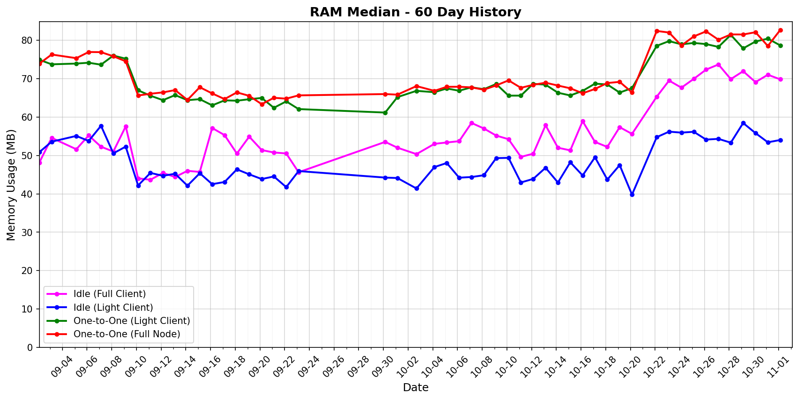

# status-go-benchmarks

Benchmark metrics with 30-day history and latest comparison.

## 30-Day History

| Metric History                                         | Metric History                                     |
|--------------------------------------------------------|----------------------------------------------------|
|  |    |
|  |    |
|      |  |

## Latest Report (2025-08-13)

| Run       | Date       | Time     | Commit      |
|-----------|------------|----------|-------------|
| Contender | 2025-08-13 | 16:07:29 | `d603c29b9` |
| Baseline  | 2025-08-13 | 15:26:42 | `fc453d5eb` |

| Metric                | test_idle [waku_light_client_True]                                                                                            | test_one_to_one_messages [waku_light_client_True]                                                                                                           | test_one_to_one_messages [waku_light_client_False]                                                                                                            |
|-----------------------|----------------------------------------------------------------------------------------------------------------------------------|----------------------------------------------------------------------------------------------------------------------------------------------------------------|------------------------------------------------------------------------------------------------------------------------------------------------------------------|
| CPU Median            | 1.25% (+1.2%)                                                                                                                    | 5.42% (-14.5%)                                                                                                                                                 | 5.00% (-10.1%)                                                                                                                                                   |
| CPU Max               | 136.49% (-2.4%)                                                                                                                  | 111.44% (-36.3%)                                                                                                                                               | 145.61% (+21.0%)                                                                                                                                                 |
| RAM Median            | 53.93 MB (-3.4%)                                                                                                                 | 80.70 MB (+3.3%)                                                                                                                                               | 78.28 MB (+0.2%)                                                                                                                                                 |
| RAM Max               | 53.93 MB (-3.8%)                                                                                                                 | 84.90 MB (-4.4%)                                                                                                                                               | 88.71 MB (-2.9%)                                                                                                                                                 |
| RX Total              | 88.2 KB (+2.9%)                                                                                                                  | 2.08 MB (+1.1%)                                                                                                                                                | 2.05 MB (+1.2%)                                                                                                                                                  |
| TX Total              | 567.8 KB (+0.5%)                                                                                                                 | 3.40 MB (+0.3%)                                                                                                                                                | 3.83 MB (-0.2%)                                                                                                                                                  |
| **Performance Chart** | ![test_idle[waku_light_client_True]](benchmarks/20250813T160729_d603c29b9/test_idle[waku_light_client_True]-20250813-160018.png) | ![test_one_to_one_messages[waku_light_client_True]](benchmarks/20250813T160729_d603c29b9/test_one_to_one_messages[waku_light_client_True]-20250813-160648.png) | ![test_one_to_one_messages[waku_light_client_False]](benchmarks/20250813T160729_d603c29b9/test_one_to_one_messages[waku_light_client_False]-20250813-160331.png) |
