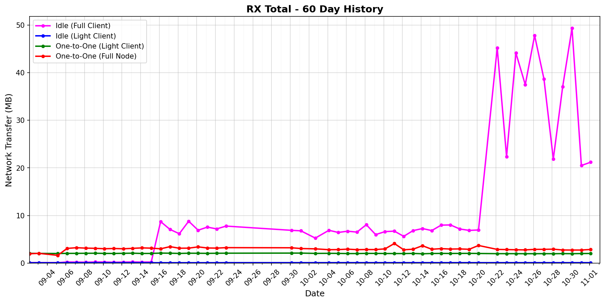

# status-go-benchmarks

Benchmark metrics with 60-day history and latest comparison.

## 60-Day History

| Metric History                                                     | Metric History                                               |
|--------------------------------------------------------------------|--------------------------------------------------------------|
|              |              |
|              |              |
|                  |            |
|  |  |

## Latest Report (2025-11-06)

| Run       | Date       | Time     | Commit      |
|-----------|------------|----------|-------------|
| Contender | 2025-11-06 | 03:08:11 | `0191cb47f` |
| Baseline  | 2025-11-05 | 03:08:03 | `ff7c09338` |

| Metric                | test_idle [waku_light_client_False]                                                                                             | test_idle [waku_light_client_True]                                                                                            | test_one_to_one_messages [waku_light_client_True]                                                                                                           | test_one_to_one_messages [waku_light_client_False]                                                                                                            |
|-----------------------|------------------------------------------------------------------------------------------------------------------------------------|----------------------------------------------------------------------------------------------------------------------------------|----------------------------------------------------------------------------------------------------------------------------------------------------------------|------------------------------------------------------------------------------------------------------------------------------------------------------------------|
| CPU Median            | 5.68% (-90.1%)                                                                                                                     | 0.58% (+7.6%)                                                                                                                    | 3.12% (+1.5%)                                                                                                                                                  | 3.87% (+2.1%)                                                                                                                                                    |
| CPU Max               | 206.81% (+1.1%)                                                                                                                    | 201.63% (-1.5%)                                                                                                                  | 177.84% (-12.2%)                                                                                                                                               | 188.48% (+10.1%)                                                                                                                                                 |
| RAM Median            | 58.51 MB (-19.1%)                                                                                                                  | 55.46 MB (+3.9%)                                                                                                                 | 79.34 MB (-0.7%)                                                                                                                                               | 81.73 MB (+1.5%)                                                                                                                                                 |
| RAM Max               | 88.30 MB (-7.6%)                                                                                                                   | 56.26 MB (+2.3%)                                                                                                                 | 105.46 MB (+1.0%)                                                                                                                                              | 107.10 MB (-0.5%)                                                                                                                                                |
| RX Total              | 15.78 MB (-33.0%)                                                                                                                  | 103.8 KB (+0.5%)                                                                                                                 | 2.03 MB (+1.4%)                                                                                                                                                | 2.93 MB (+4.1%)                                                                                                                                                  |
| TX Total              | 8.58 MB (-57.0%)                                                                                                                   | 584.7 KB (-0.1%)                                                                                                                 | 3.22 MB (+0.8%)                                                                                                                                                | 5.28 MB (+3.5%)                                                                                                                                                  |
| Goroutines count      | 279 (-2.4%)                                                                                                                        | 204 (0%)                                                                                                                         | 1065 (+0.9%)                                                                                                                                                   | 1128 (+1.1%)                                                                                                                                                     |
| Threads count         | 39 (0%)                                                                                                                            | 38 (-2.6%)                                                                                                                       | 39 (-4.9%)                                                                                                                                                     | 40 (0%)                                                                                                                                                          |
| **Performance Chart** | ![test_idle[waku_light_client_False]](benchmarks/20251106T030811_0191cb47f/test_idle[waku_light_client_False]-20251106-030005.png) | ![test_idle[waku_light_client_True]](benchmarks/20251106T030811_0191cb47f/test_idle[waku_light_client_True]-20251106-030140.png) | ![test_one_to_one_messages[waku_light_client_True]](benchmarks/20251106T030811_0191cb47f/test_one_to_one_messages[waku_light_client_True]-20251106-030728.png) | ![test_one_to_one_messages[waku_light_client_False]](benchmarks/20251106T030811_0191cb47f/test_one_to_one_messages[waku_light_client_False]-20251106-030432.png) |
