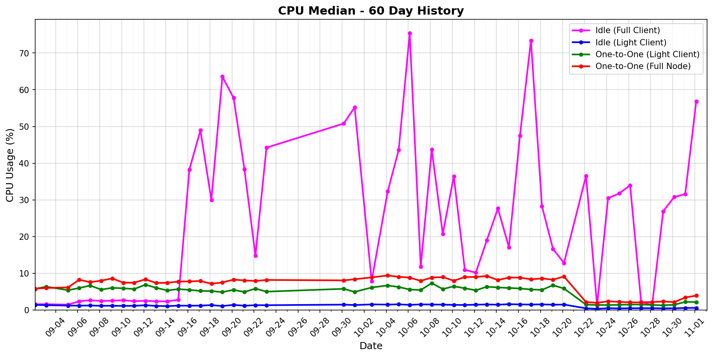

# status-go-benchmarks

Benchmark metrics with 30-day history and latest comparison.

## 30-Day History

| Metric History                                         | Metric History                                     |
|--------------------------------------------------------|----------------------------------------------------|
|  |    |
|  |    |
|      |  |

## Latest Report (2025-09-19)

| Run       | Date       | Time     | Commit      |
|-----------|------------|----------|-------------|
| Contender | 2025-09-19 | 03:13:17 | `4edf1bed1` |
| Baseline  | 2025-09-18 | 03:13:15 | `840adb83d` |

| Metric                | test_idle [waku_light_client_True]                                                                                            | test_one_to_one_messages [waku_light_client_True]                                                                                                           | test_one_to_one_messages [waku_light_client_False]                                                                                                            |
|-----------------------|----------------------------------------------------------------------------------------------------------------------------------|----------------------------------------------------------------------------------------------------------------------------------------------------------------|------------------------------------------------------------------------------------------------------------------------------------------------------------------|
| CPU Median            | 1.10% (-18.1%)                                                                                                                   | 4.89% (-5.4%)                                                                                                                                                  | 7.52% (+4.9%)                                                                                                                                                    |
| CPU Max               | 139.32% (+24.5%)                                                                                                                 | 106.90% (-5.3%)                                                                                                                                                | 107.99% (-3.7%)                                                                                                                                                  |
| RAM Median            | 45.08 MB (-2.8%)                                                                                                                 | 64.65 MB (+0.6%)                                                                                                                                               | 65.52 MB (-1.4%)                                                                                                                                                 |
| RAM Max               | 53.22 MB (+7.5%)                                                                                                                 | 67.83 MB (-7.3%)                                                                                                                                               | 78.65 MB (-3.6%)                                                                                                                                                 |
| RX Total              | 91.3 KB (+0.4%)                                                                                                                  | 2.09 MB (+2.1%)                                                                                                                                                | 3.15 MB (+0.5%)                                                                                                                                                  |
| TX Total              | 584.7 KB (+0.9%)                                                                                                                 | 3.50 MB (+1.8%)                                                                                                                                                | 5.28 MB (+1.7%)                                                                                                                                                  |
| **Performance Chart** | ![test_idle[waku_light_client_True]](benchmarks/20250919T031317_4edf1bed1/test_idle[waku_light_client_True]-20250919-030544.png) | ![test_one_to_one_messages[waku_light_client_True]](benchmarks/20250919T031317_4edf1bed1/test_one_to_one_messages[waku_light_client_True]-20250919-031231.png) | ![test_one_to_one_messages[waku_light_client_False]](benchmarks/20250919T031317_4edf1bed1/test_one_to_one_messages[waku_light_client_False]-20250919-030902.png) |
