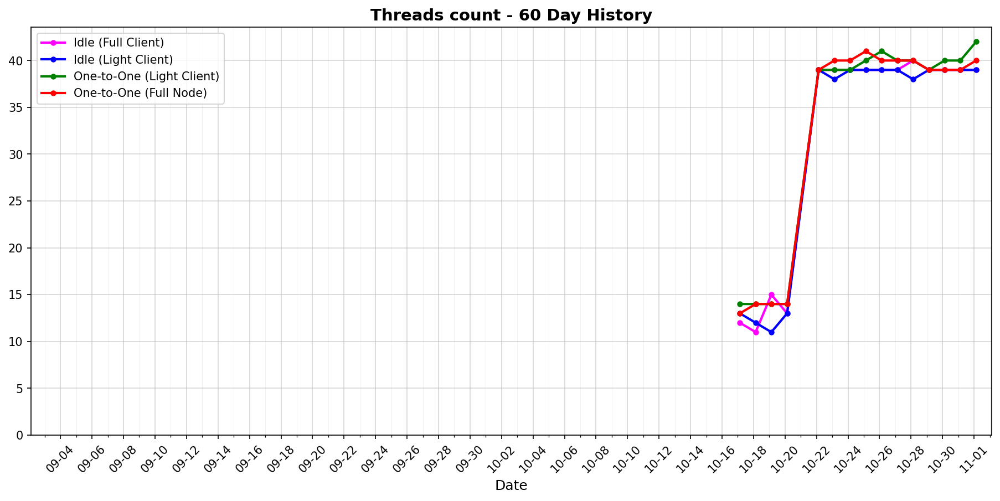

# status-go-benchmarks

Benchmark metrics with 60-day history and latest comparison.

## 60-Day History

| Metric History                                                     | Metric History                                               |
|--------------------------------------------------------------------|--------------------------------------------------------------|
|              |              |
|              |              |
|                  |            |
|  |  |

## Latest Report (2025-11-10)

| Run       | Date       | Time     | Commit      |
|-----------|------------|----------|-------------|
| Contender | 2025-11-10 | 03:07:24 | `60cd34856` |
| Baseline  | 2025-11-09 | 03:07:23 | `60cd34856` |

| Metric                | test_idle [waku_light_client_False]                                                                                             | test_idle [waku_light_client_True]                                                                                            | test_one_to_one_messages [waku_light_client_True]                                                                                                           | test_one_to_one_messages [waku_light_client_False]                                                                                                            |
|-----------------------|------------------------------------------------------------------------------------------------------------------------------------|----------------------------------------------------------------------------------------------------------------------------------|----------------------------------------------------------------------------------------------------------------------------------------------------------------|------------------------------------------------------------------------------------------------------------------------------------------------------------------|
| CPU Median            | 43.27% (-32.1%)                                                                                                                    | 0.57% (+2.1%)                                                                                                                    | 2.09% (+0.5%)                                                                                                                                                  | 4.01% (+14.7%)                                                                                                                                                   |
| CPU Max               | 239.71% (+15.1%)                                                                                                                   | 142.78% (+0.8%)                                                                                                                  | 152.56% (+4.5%)                                                                                                                                                | 195.98% (+0.2%)                                                                                                                                                  |
| RAM Median            | 70.32 MB (+1.2%)                                                                                                                   | 52.66 MB (-6.3%)                                                                                                                 | 78.02 MB (-1.0%)                                                                                                                                               | 81.20 MB (+1.0%)                                                                                                                                                 |
| RAM Max               | 90.94 MB (+0.6%)                                                                                                                   | 57.38 MB (-5.4%)                                                                                                                 | 106.82 MB (+1.4%)                                                                                                                                              | 106.91 MB (-0.1%)                                                                                                                                                |
| RX Total              | 21.62 MB (-7.0%)                                                                                                                   | 103.6 KB (-0.2%)                                                                                                                 | 2.01 MB (+0.5%)                                                                                                                                                | 2.84 MB (-0.6%)                                                                                                                                                  |
| TX Total              | 11.54 MB (-41.4%)                                                                                                                  | 585.4 KB (+0.1%)                                                                                                                 | 3.20 MB (-0.5%)                                                                                                                                                | 5.21 MB (-0.3%)                                                                                                                                                  |
| Goroutines count      | 286 (+2.5%)                                                                                                                        | 204 (0%)                                                                                                                         | 1074 (+0.8%)                                                                                                                                                   | 1136 (+0.9%)                                                                                                                                                     |
| Threads count         | 39 (0%)                                                                                                                            | 39 (+2.6%)                                                                                                                       | 40 (0%)                                                                                                                                                        | 39 (-2.5%)                                                                                                                                                       |
| **Performance Chart** | ![test_idle[waku_light_client_False]](benchmarks/20251110T030724_60cd34856/test_idle[waku_light_client_False]-20251110-025915.png) | ![test_idle[waku_light_client_True]](benchmarks/20251110T030724_60cd34856/test_idle[waku_light_client_True]-20251110-030051.png) | ![test_one_to_one_messages[waku_light_client_True]](benchmarks/20251110T030724_60cd34856/test_one_to_one_messages[waku_light_client_True]-20251110-030639.png) | ![test_one_to_one_messages[waku_light_client_False]](benchmarks/20251110T030724_60cd34856/test_one_to_one_messages[waku_light_client_False]-20251110-030344.png) |
