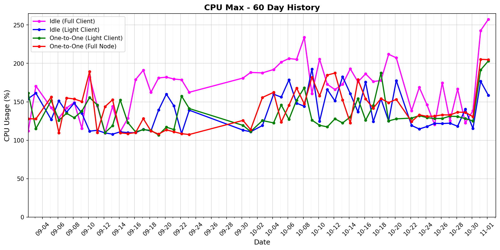

# status-go-benchmarks

Benchmark metrics with 60-day history and latest comparison.

## 60-Day History

| Metric History                                                     | Metric History                                               |
|--------------------------------------------------------------------|--------------------------------------------------------------|
|              |              |
|              |              |
|                  |            |
|  |  |

## Latest Report (2026-02-08)

| Run       | Date       | Time     | Commit      |
|-----------|------------|----------|-------------|
| Contender | 2026-02-08 | 03:07:37 | `dcdd1f1e0` |
| Baseline  | 2026-02-07 | 03:07:48 | `dcdd1f1e0` |

| Metric                | test_idle [waku_light_client_False]                                                                                             | test_idle [waku_light_client_True]                                                                                            | test_one_to_one_messages [waku_light_client_True]                                                                                                           | test_one_to_one_messages [waku_light_client_False]                                                                                                            |
|-----------------------|------------------------------------------------------------------------------------------------------------------------------------|----------------------------------------------------------------------------------------------------------------------------------|----------------------------------------------------------------------------------------------------------------------------------------------------------------|------------------------------------------------------------------------------------------------------------------------------------------------------------------|
| CPU Median            | 48.22% (-4.6%)                                                                                                                     | 0.55% (+39.6%)                                                                                                                   | 2.76% (-2.2%)                                                                                                                                                  | 3.71% (+19.6%)                                                                                                                                                   |
| CPU Max               | 200.40% (-11.0%)                                                                                                                   | 192.90% (+6.2%)                                                                                                                  | 141.46% (-2.1%)                                                                                                                                                | 179.92% (-11.8%)                                                                                                                                                 |
| RAM Median            | 79.91 MB (+1.2%)                                                                                                                   | 62.56 MB (-1.0%)                                                                                                                 | 87.79 MB (-2.3%)                                                                                                                                               | 90.63 MB (-2.8%)                                                                                                                                                 |
| RAM Max               | 97.88 MB (-0.4%)                                                                                                                   | 72.45 MB (-2.7%)                                                                                                                 | 110.44 MB (-5.2%)                                                                                                                                              | 114.71 MB (-1.0%)                                                                                                                                                |
| RX Total              | 20.95 MB (-3.4%)                                                                                                                   | 101.9 KB (-0.3%)                                                                                                                 | 2.02 MB (+1.4%)                                                                                                                                                | 2.78 MB (-0.5%)                                                                                                                                                  |
| TX Total              | 11.18 MB (+0.1%)                                                                                                                   | 579.4 KB (+0.3%)                                                                                                                 | 3.18 MB (-0.1%)                                                                                                                                                | 5.12 MB (+2.5%)                                                                                                                                                  |
| Goroutines count      | 287 (0%)                                                                                                                           | 205 (0%)                                                                                                                         | 1038 (-0.3%)                                                                                                                                                   | 1101 (-1.5%)                                                                                                                                                     |
| Threads count         | 40 (+2.6%)                                                                                                                         | 40 (+5.3%)                                                                                                                       | 40 (0%)                                                                                                                                                        | 42 (+2.4%)                                                                                                                                                       |
| **Performance Chart** | ![test_idle[waku_light_client_False]](benchmarks/20260208T030737_dcdd1f1e0/test_idle[waku_light_client_False]-20260208-025914.png) | ![test_idle[waku_light_client_True]](benchmarks/20260208T030737_dcdd1f1e0/test_idle[waku_light_client_True]-20260208-030050.png) | ![test_one_to_one_messages[waku_light_client_True]](benchmarks/20260208T030737_dcdd1f1e0/test_one_to_one_messages[waku_light_client_True]-20260208-030640.png) | ![test_one_to_one_messages[waku_light_client_False]](benchmarks/20260208T030737_dcdd1f1e0/test_one_to_one_messages[waku_light_client_False]-20260208-030343.png) |
