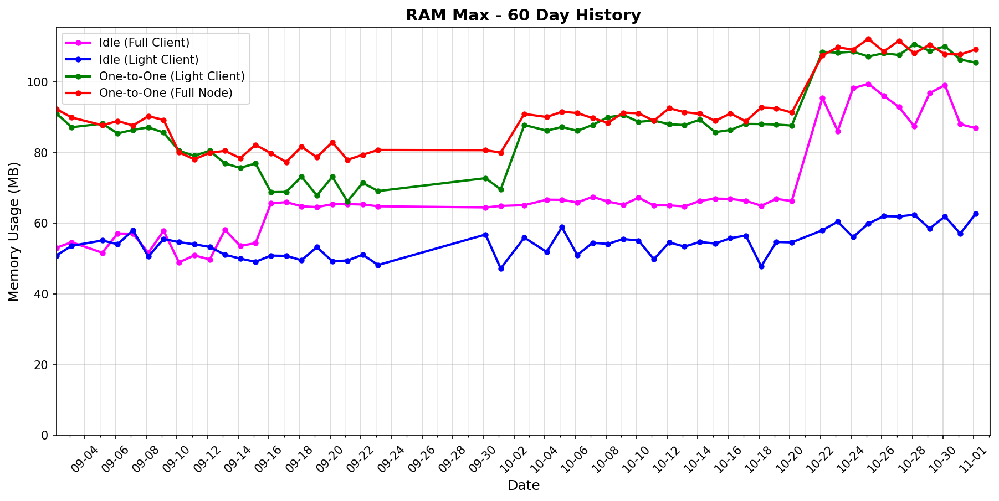

# status-go-benchmarks

Benchmark metrics with 60-day history and latest comparison.

## 60-Day History

| Metric History                                                     | Metric History                                               |
|--------------------------------------------------------------------|--------------------------------------------------------------|
|              |              |
|              |              |
|                  |            |
|  |  |

## Latest Report (2026-02-10)

| Run       | Date       | Time     | Commit      |
|-----------|------------|----------|-------------|
| Contender | 2026-02-10 | 03:11:31 | `747e5c896` |
| Baseline  | 2026-02-09 | 03:07:37 | `dcdd1f1e0` |

| Metric                | test_idle [waku_light_client_False]                                                                                             | test_idle [waku_light_client_True]                                                                                            | test_one_to_one_messages [waku_light_client_True]                                                                                                           | test_one_to_one_messages [waku_light_client_False]                                                                                                            |
|-----------------------|------------------------------------------------------------------------------------------------------------------------------------|----------------------------------------------------------------------------------------------------------------------------------|----------------------------------------------------------------------------------------------------------------------------------------------------------------|------------------------------------------------------------------------------------------------------------------------------------------------------------------|
| CPU Median            | 4.71% (-92.8%)                                                                                                                     | 0.54% (-5.2%)                                                                                                                    | 1.94% (-5.1%)                                                                                                                                                  | 3.82% (-2.7%)                                                                                                                                                    |
| CPU Max               | 243.94% (+18.9%)                                                                                                                   | 172.24% (+21.7%)                                                                                                                 | 160.26% (-9.7%)                                                                                                                                                | 241.65% (-2.6%)                                                                                                                                                  |
| RAM Median            | 79.11 MB (-3.2%)                                                                                                                   | 63.48 MB (-3.1%)                                                                                                                 | 89.20 MB (+0.8%)                                                                                                                                               | 91.39 MB (+0.3%)                                                                                                                                                 |
| RAM Max               | 102.80 MB (+0.9%)                                                                                                                  | 78.76 MB (-2.9%)                                                                                                                 | 114.79 MB (+0.5%)                                                                                                                                              | 116.52 MB (+1.0%)                                                                                                                                                |
| RX Total              | 16.78 MB (-25.8%)                                                                                                                  | 101.4 KB (-0.6%)                                                                                                                 | 2.00 MB (-0.2%)                                                                                                                                                | 2.92 MB (+3.1%)                                                                                                                                                  |
| TX Total              | 9.73 MB (-49.1%)                                                                                                                   | 577.5 KB (+0.1%)                                                                                                                 | 3.18 MB (-0.4%)                                                                                                                                                | 5.35 MB (+4.5%)                                                                                                                                                  |
| Goroutines count      | 287 (0%)                                                                                                                           | 205 (0%)                                                                                                                         | 1036 (+1.6%)                                                                                                                                                   | 1118 (-0.4%)                                                                                                                                                     |
| Threads count         | 40 (0%)                                                                                                                            | 40 (0%)                                                                                                                          | 41 (-2.4%)                                                                                                                                                     | 41 (-2.4%)                                                                                                                                                       |
| **Performance Chart** | ![test_idle[waku_light_client_False]](benchmarks/20260210T031131_747e5c896/test_idle[waku_light_client_False]-20260210-030312.png) | ![test_idle[waku_light_client_True]](benchmarks/20260210T031131_747e5c896/test_idle[waku_light_client_True]-20260210-030448.png) | ![test_one_to_one_messages[waku_light_client_True]](benchmarks/20260210T031131_747e5c896/test_one_to_one_messages[waku_light_client_True]-20260210-031037.png) | ![test_one_to_one_messages[waku_light_client_False]](benchmarks/20260210T031131_747e5c896/test_one_to_one_messages[waku_light_client_False]-20260210-030741.png) |
